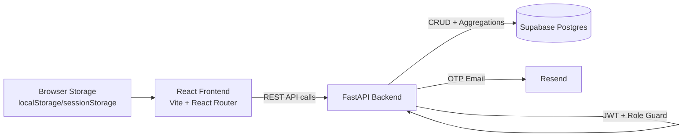

# Rental Management Platform (REMS)

A full-stack rental operations system for owner and tenant workflows, built with React + FastAPI + Supabase.

This document is written as a team handoff guide and PPT-ready project brief.

---

## 1) Executive Summary (PPT-Ready)

### Problem
Rental operations usually run across disconnected WhatsApp chats, spreadsheets, and manual follow-ups. This creates delays in onboarding, leasing, payment tracking, and maintenance handling.

### Solution
REMS centralizes the full lifecycle in one platform:
- Role-based onboarding for owners and tenants
- OTP-based signup and password reset
- Property listing and search
- Visit requests and applications
- Lease, payment, maintenance, and document workflows

### Current Stage
- Full frontend-backend integration for core owner and tenant journeys
- Supabase-backed workflow APIs are live
- Authentication, role guards, and dashboard routing are implemented
- Documentation and demo runbooks are ready for team use

### Differentiators
- Single email can be used for both owner and tenant (normalized mode)
- Role-aware JWT claim enforcement on protected APIs
- Schema-drift-tolerant insert fallback for Supabase column mismatch scenarios

---

## 2) Product Scope and Workflow Coverage

### Owner Workflow
1. Register and verify email OTP
2. Log in as owner role
3. Create and update properties
4. Review tenant applications
5. Create and manage leases
6. Track and record rent payments
7. Manage maintenance tickets
8. Review and update document sharing/verification

### Tenant Workflow
1. Register and verify email OTP
2. Log in as tenant role
3. Browse available properties
4. View property details
5. Request visits
6. Submit stay applications
7. Track dashboard activity and application states

---

## 3) Architecture Overview



### Runtime Layering
- Frontend app: `client/`
- Backend API: `server/app/`
- Database: Supabase tables (configurable via env)
- Email delivery: Resend

---

## 4) Tech Stack and Libraries

### Frontend (`client/package.json`)
- React `^19.2.4`
- React DOM `^19.2.4`
- React Router DOM `^7.14.0`
- Three.js `^0.183.2`
- Vite `^8.0.1`
- ESLint ecosystem (`@eslint/js`, `eslint-plugin-react-hooks`, `eslint-plugin-react-refresh`)

### Backend (`server/requirements.txt`)
- `fastapi>=0.110.0`
- `uvicorn[standard]>=0.29.0`
- `supabase>=2.28.0,<2.29.0`
- `passlib[bcrypt]>=1.7.4`
- `bcrypt==4.0.1`
- `python-jose[cryptography]>=3.3.0`
- `python-dotenv>=1.0.1`
- `resend>=2.4.0`
- `email-validator>=2.1.0`
- `httpx>=0.26,<0.29`

---

## 5) Repository Map (Relevant)

```text
rental-management/
  README.md
  docker-compose.yml            # currently empty
  client/
    package.json
    src/
      App.jsx
      main.jsx
      context/AuthContext.jsx
      services/
        apiClient.js
        sessionService.js
      pages/
        Authpage.jsx
        Ownerdashboard.jsx
        Tenantdashboard.jsx
        PropertiesList.jsx
        AddProperty.jsx
        EditProperty.jsx
        PropertyDetail.jsx
        LeaseManagement.jsx
        OwnerPayments.jsx
        OwnerMaintenance.jsx
        OwnerDocuments.jsx
        TenantSearch.jsx
        TenantPropertyDetail.jsx
        TenantApply.jsx
  server/
    .env
    requirements.txt
    app/
      main.py
      api/routes/
        registration.py
        dependencies.py
        workflow.py
      core/
        security.py
        otp_store.py
        mailer.py
      db/
        database.py
    tests/                      # currently empty
    services/                   # currently empty
  infra/                        # currently empty
```

---

## 6) Frontend Application Design

### Routing and Role Guards
The frontend route tree in `client/src/App.jsx` enforces:
- `/` auto-redirect by auth state and role
- `/auth` redirect away when already logged in
- Owner-only screens guarded by `ProtectedRoute allowedRole="owner"`
- Tenant-only screens guarded by `ProtectedRoute allowedRole="tenant"`

### Session Model
`client/src/services/sessionService.js` stores session as:
- `localStorage` when remember-me is enabled
- `sessionStorage` otherwise
- automatic cleanup when token expiry has passed

### API Integration
`client/src/services/apiClient.js` provides centralized wrappers for:
- Auth APIs
- Owner workflow APIs
- Tenant workflow APIs
- Automatic `Authorization: Bearer <token>` header injection via `getAuthHeader()`

---

## 7) Backend API Design

### App Entry
`server/app/main.py`
- Creates FastAPI app
- Applies CORS from `CORS_ALLOW_ORIGINS`
- Includes both routers with `/api` prefix
- Exposes `GET /health`

### Authentication and Registration Router
`server/app/api/routes/registration.py`

| Method | Endpoint | Purpose | Auth |
|---|---|---|---|
| POST | `/api/tenant/register` | Tenant signup with OTP validation | Public |
| POST | `/api/owner/register` | Owner signup with OTP validation | Public |
| POST | `/api/auth/login` | Role-based login, JWT issue | Public |
| POST | `/api/auth/forgot-password` | Send reset OTP email | Public |
| POST | `/api/auth/send-signup-otp` | Send signup OTP email | Public |
| POST | `/api/auth/verify-signup-otp` | Validate signup OTP | Public |
| POST | `/api/auth/reset-password` | Reset password with OTP | Public |

### Workflow Router
`server/app/api/routes/workflow.py`

| Method | Endpoint | Purpose | Auth |
|---|---|---|---|
| GET | `/api/owner/properties` | List owner properties | Owner |
| GET | `/api/owner/properties/{property_id}` | Owner property detail + related records | Owner |
| POST | `/api/owner/properties` | Create property + terms | Owner |
| PUT | `/api/owner/properties/{property_id}` | Update property + terms | Owner |
| GET | `/api/owner/dashboard` | Owner KPIs + recent applications/visits | Owner |
| GET | `/api/properties/browse` | Public property browsing with filters | Public |
| GET | `/api/tenant/properties/{property_id}` | Tenant property detail | Tenant |
| POST | `/api/tenant/properties/{property_id}/visit-requests` | Submit visit request | Tenant |
| POST | `/api/tenant/properties/{property_id}/applications` | Submit stay application | Tenant |
| GET | `/api/tenant/applications` | Tenant application history | Tenant |
| GET | `/api/owner/applications` | Owner applications list | Owner |
| PATCH | `/api/owner/applications/{application_id}` | Approve/reject application | Owner |
| GET | `/api/tenant/dashboard` | Tenant dashboard data | Tenant |
| GET | `/api/owner/maintenance` | List maintenance tickets + summary | Owner |
| POST | `/api/owner/maintenance` | Create maintenance ticket | Owner |
| PATCH | `/api/owner/maintenance/{ticket_id}` | Update maintenance ticket | Owner |
| GET | `/api/owner/documents` | List documents + summary | Owner |
| PATCH | `/api/owner/documents/{document_id}` | Update document metadata | Owner |
| GET | `/api/owner/leases` | List leases + summary metrics | Owner |
| POST | `/api/owner/leases` | Create lease | Owner |
| PATCH | `/api/owner/leases/{lease_id}` | Lease actions (renewal/notice/terminate) | Owner |
| GET | `/api/owner/payments` | Payment list + payouts + summary | Owner |
| POST | `/api/owner/payments/{payment_id}/record` | Mark payment as paid and record details | Owner |

### Workflow Query/Action Highlights
- Property browse filters: `city`, `propertyType`, `bhk`, `minRent`, `maxRent`, `availableOnly`, `limit`
- Owner applications filter: `statusFilter`
- Owner maintenance filters: `statusFilter`, `propertyId`
- Owner documents filters: `categoryFilter`, `propertyId`
- Lease actions payload: `send_renewal`, `send_notice`, `terminate`

---

## 8) Authentication, Authorization, and Multi-Role Behavior

### JWT and Password Security
- Password hashing uses Passlib with bcrypt
- Login creates JWT with subject claim (`sub`) and active role claim (`role`)
- Access token expiry is env-driven (`JWT_ACCESS_TOKEN_EXPIRE_MINUTES`)

### OTP Flows
- Signup OTP and reset OTP are generated in-memory (`otp_store.py`)
- OTPs are hashed with a pepper derived from `JWT_SECRET_KEY`
- OTPs expire and enforce max-attempt logic

### Same Email for Owner + Tenant (Normalized Mode)
In `SUPABASE_SCHEMA_MODE=normalized`:
- A single email identity can register both roles
- Duplicate registration is blocked only for the same role
- Login requires explicit role selection
- Token carries that selected role
- Protected routes verify the role is truly enabled by role-specific records
  - Tenant capability: record in tenant profile table
  - Owner capability: record in properties table

This supports one person operating as both tenant and owner with one email.

---

## 9) Schema Compatibility and Resilience

### Insert Fallback for Unknown Columns
Registration and selected workflow inserts support schema-drift fallback:
- If Supabase returns unknown-column errors, unsupported keys are dropped
- Insert is retried with reduced payload
- Retries are bounded dynamically by payload size

This is useful when environments have slight table drift or stale schema assumptions.

### Missing Workflow Tables
Optional workflow reads/inserts detect missing relation errors and return meaningful API errors instead of raw DB traces.

---

## 10) Environment Variables

Set these in `server/.env`.

### Required Core
| Variable | Purpose |
|---|---|
| `SUPABASE_URL` | Supabase project URL |
| `SUPABASE_KEY` | Supabase key (service role recommended for backend writes) |
| `JWT_SECRET_KEY` | JWT signing secret |

### Auth and API Behavior
| Variable | Default | Purpose |
|---|---|---|
| `JWT_ALGORITHM` | `HS256` | JWT algorithm |
| `JWT_ACCESS_TOKEN_EXPIRE_MINUTES` | `60` | Access token TTL |
| `JWT_PASSWORD_RESET_EXPIRE_MINUTES` | `30` | Password reset token TTL helper |
| `CORS_ALLOW_ORIGINS` | `http://localhost:5173` | Comma-separated allowed frontend origins |

### Schema Mode and Table Mapping
| Variable | Default |
|---|---|
| `SUPABASE_SCHEMA_MODE` | `legacy` |
| `SUPABASE_USERS_TABLE` | `users` |
| `SUPABASE_AUTH_CREDENTIALS_TABLE` | `auth_credentials` |
| `SUPABASE_TENANT_PROFILE_TABLE` | `tenant_profiles` |
| `SUPABASE_TENANT_TABLE` | `tenants` |
| `SUPABASE_OWNER_TABLE` | `owners` |
| `SUPABASE_PROPERTIES_TABLE` | `properties` |
| `SUPABASE_PROPERTY_TERMS_TABLE` | `property_terms` |
| `SUPABASE_PROPERTY_MEDIA_TABLE` | `property_media` |
| `SUPABASE_VISIT_REQUESTS_TABLE` | `visit_requests` |
| `SUPABASE_STAY_APPLICATIONS_TABLE` | `stay_applications` |
| `SUPABASE_TENANCIES_TABLE` | `tenancies` |
| `SUPABASE_PAYMENTS_TABLE` | `rent_payments` |
| `SUPABASE_MAINTENANCE_TABLE` | `maintenance_requests` |
| `SUPABASE_DOCUMENTS_TABLE` | `property_documents` |
| `SUPABASE_USER_NAME_COLUMN` | `fullName` |
| `SUPABASE_USER_PHONE_COUNTRY_COLUMN` | `phoneCountry` |
| `SUPABASE_USER_PASSWORD_COLUMN` | `password` |

### OTP and Mail Delivery
| Variable | Default | Purpose |
|---|---|---|
| `SIGNUP_OTP_EXPIRE_MINUTES` | `10` | Signup OTP TTL |
| `PASSWORD_RESET_OTP_EXPIRE_MINUTES` | `10` | Reset OTP TTL |
| `EXPOSE_RESET_TOKEN` | `false` | Development fallback to include OTP in response |
| `RESEND_API_KEY` | none | Resend API key |
| `MAIL_FROM` | `onboarding@resend.dev` | Sender email used by mailer |

### Example `server/.env`
```ini
SUPABASE_URL=https://your-project.supabase.co
SUPABASE_KEY=your-supabase-service-role-key

JWT_SECRET_KEY=replace-with-a-long-random-secret
JWT_ALGORITHM=HS256
JWT_ACCESS_TOKEN_EXPIRE_MINUTES=60
CORS_ALLOW_ORIGINS=http://localhost:5173

SUPABASE_SCHEMA_MODE=normalized
SUPABASE_USERS_TABLE=users
SUPABASE_AUTH_CREDENTIALS_TABLE=auth_credentials
SUPABASE_TENANT_PROFILE_TABLE=tenant_profiles
SUPABASE_PROPERTIES_TABLE=properties
SUPABASE_PROPERTY_TERMS_TABLE=property_terms
SUPABASE_PROPERTY_MEDIA_TABLE=property_media
SUPABASE_VISIT_REQUESTS_TABLE=visit_requests
SUPABASE_STAY_APPLICATIONS_TABLE=stay_applications
SUPABASE_TENANCIES_TABLE=tenancies
SUPABASE_PAYMENTS_TABLE=rent_payments
SUPABASE_MAINTENANCE_TABLE=maintenance_requests
SUPABASE_DOCUMENTS_TABLE=property_documents

SIGNUP_OTP_EXPIRE_MINUTES=10
PASSWORD_RESET_OTP_EXPIRE_MINUTES=10
EXPOSE_RESET_TOKEN=false
RESEND_API_KEY=your-resend-key
MAIL_FROM=onboarding@resend.dev
```

Frontend env (`client/.env.local`):
```ini
VITE_API_BASE_URL=http://localhost:8000
```

---

## 11) Local Development Setup

### Backend (FastAPI)
```bash
cd rental-management/server
python -m pip install -r requirements.txt
python -m uvicorn app.main:app --app-dir . --host 0.0.0.0 --port 8000 --reload
```

Health check:
```bash
curl http://localhost:8000/health
```
Expected response:
```json
{"status":"ok"}
```

### Frontend (React)
```bash
cd rental-management/client
npm install
npm run dev -- --host 0.0.0.0 --port 5173
```

Quality checks:
```bash
npm run lint
npm run build
```

---

## 12) Two-Laptop Demo Runbook (Presentation Friendly)

### Goal
Run backend on Laptop A, access the app from both laptops for owner and tenant demo.

### Steps
1. Connect both laptops to same network.
2. Start backend on Laptop A with host `0.0.0.0`.
3. Set frontend API base URL on both laptops to `http://<Laptop-A-IP>:8000`.
4. Include both frontend origins in `CORS_ALLOW_ORIGINS`.
5. Run owner flow on Laptop A and tenant flow on Laptop B.

### Suggested Demo Storyline
1. Owner signup with OTP
2. Owner login and property workflow
3. Tenant signup/login and property search
4. Tenant visit request and application
5. Owner application review, lease creation, and payment/maintenance/document modules

---

## 13) Current Implementation Gaps

- OTP store is in-memory (not distributed, resets on server restart)
- No automated test suite yet (`server/tests` is empty)
- `docker-compose.yml` and `infra/` scaffolding are present but not implemented
- `server/services/` is currently empty
- Resend sandbox/test-mode limitations can block external recipient delivery

---

## 14) Production Hardening Checklist

1. Move OTP storage to Redis or database-backed store
2. Add rate limiting for OTP and login attempts
3. Add API integration tests and frontend e2e tests
4. Introduce structured logging and monitoring
5. Add refresh-token and token revocation strategy
6. Complete Docker and infra automation
7. Add CI pipeline for lint, test, and build gates
8. Formalize DB migration/versioning strategy
9. Enforce secrets management (vault/secret manager)
10. Add backup and rollback runbooks

---

## 15) Suggested PPT Deck Outline

1. Problem and Opportunity
2. Product Vision and User Roles
3. System Architecture (Frontend, API, Supabase, Email)
4. End-to-End Owner Workflow
5. End-to-End Tenant Workflow
6. Security and Role-Based Access
7. Current Milestone and Demonstrated Features
8. Risks, Gaps, and Next Sprint Roadmap

---

## 16) Quick Command Reference

Backend:
```bash
cd rental-management/server
python -m pip install -r requirements.txt
python -m uvicorn app.main:app --app-dir . --host 0.0.0.0 --port 8000 --reload
```

Frontend:
```bash
cd rental-management/client
npm install
npm run dev -- --host 0.0.0.0 --port 5173
```

Build and lint:
```bash
cd rental-management/client
npm run lint
npm run build
```

---

If you want, this README can be further split into:
- `README.md` (quick start + architecture)
- `docs/API.md` (endpoint contracts)
- `docs/DEMO.md` (demo scripts)
- `docs/DEPLOYMENT.md` (staging/prod runbooks)
